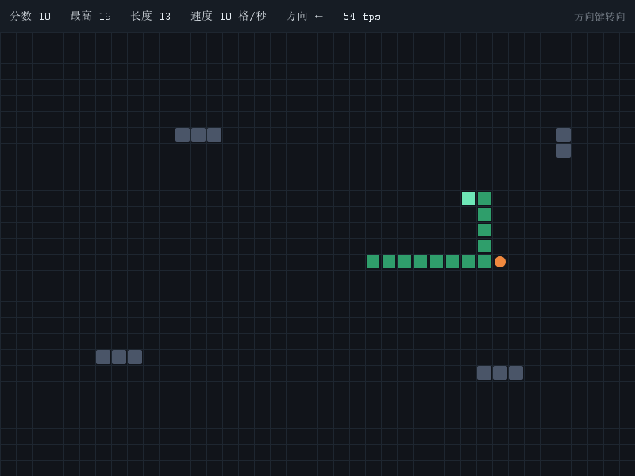

# java-snake

用 Java 17 + Swing 写的贪吃蛇，零第三方依赖，`mvn package` 之后得到一个可以直接双击运行的 jar。



状态栏显示分数、最高分、蛇长、当前速度和实时帧率；灰色方块是障碍物，橙色圆点是食物。
（这张图不是摆拍：先真实打了一局撞墙把最高分刷到 19，再重开打第二局吃到 10 分并开出折角，然后由项目自己的绘制代码渲染出来。）

## 下载与运行

到 [Releases](https://github.com/999lsdj/java-snake/releases/latest) 下载，两种选一种：

| 下载哪个 | 适合谁 | 怎么用 |
| --- | --- | --- |
| `java-snake-<版本>.jar`（约 28 KB） | 电脑上已经装了 Java 17 或更高版本 | 双击，或 `java -jar java-snake-<版本>.jar` |
| `java-snake-<版本>-windows-x64.zip`（约 22 MB） | **没装 Java** 的人，Windows 系统 | 解压后双击 `java-snake.exe`，自带运行时 |

**从源码构建**（需要 JDK 17 和 Maven）：

```
mvn clean package
java -jar target/java-snake-1.1.0.jar
```

构建完之后可以跑 `tools\deploy.ps1` 把 jar 复制到 `dist\`，然后：

- 双击根目录的 `java-snake.bat`（Windows）或执行 `./java-snake.sh`（Linux / macOS）启动游戏
- 跑 `tools\create-shortcut.ps1` 在桌面生成快捷方式
- 跑 `tools\build-app-image.ps1` 生成"自带运行时的免安装版"和分享用的 zip

## 玩法

| 操作 | 效果 |
| --- | --- |
| 方向键 | 转向（不能 180 度掉头，连续快速转向会被缓存） |
| 空格 | 暂停 / 继续（暂停时画面变暗，时间完全静止） |
| R 键 | 游戏结束后立刻重开一局 |

- 吃到食物：蛇身加长一格、分数 +1
- 每吃满 5 个食物：速度提升一档（8 格/秒起步，15 格/秒封顶）
- 撞墙、撞到自己、撞到障碍物：本局结束
- 每局随机摆放 14 个障碍物（绝不会挡在出生区）
- 最高分自动保存到 `~/.java-snake/highscore.txt`

## 技术栈

- Java 17（用 record、switch 表达式、文本块等新语法）
- Swing（JDK 自带，无第三方依赖）
- Maven + JUnit 5（29 个单元测试）
- 固定步长游戏循环：逻辑更新与渲染解耦，速度与帧率互相独立

## 代码结构

| 文件 | 职责 |
| --- | --- |
| `Main.java` | 程序入口，装配窗口与游戏循环，带 `--selftest` 自检模式 |
| `SnakeFrame.java` | 主窗口，负责把各部分接起来 |
| `GameLoop.java` | 固定步长游戏循环（纯逻辑，不依赖 Swing） |
| `SnakeGame.java` | 规则核心：蛇、食物、障碍物、分数、速度、碰撞判定（纯逻辑） |
| `Snake.java` | 蛇的身体，用 `ArrayDeque` 实现头进尾出 |
| `Direction.java` / `GridPoint.java` | 方向与网格坐标 |
| `FoodSpawner.java` / `ObstacleLayout.java` / `HighScoreStore.java` | 三个"外部世界"的接口：食物位置、障碍布局、存档 |
| `GamePanel.java` | 绘制与键盘输入 |
| `GameConfig.java` | 窗口、网格、速度等常量，带启动自检 |

## 两个设计要点

**一、逻辑与界面彻底分离。** `SnakeGame`、`Snake`、`GameLoop` 都不认识 Swing，
所以整套规则可以在没有图形界面的环境里跑测试——29 个测试里有 26 个是纯逻辑测试。

**二、随机、文件、时间这些东西全部抽到接口后面。** 正式运行给随机实现，测试给固定实现。
否则"吃到食物之后会怎样"这类断言根本无从写起。

## 开发过程

项目按五个里程碑推进，每个里程碑都有对应的讲解卡（在 `docs/` 下）：

| 里程碑 | 内容 |
| --- | --- |
| M1 | Swing 窗口 + 固定步长游戏循环 |
| M2 | 蛇的移动、键盘控制、撞墙判定 |
| M3 | 食物、成长、分数、自撞判定 |
| M4 | 结束画面、R 键快速重开、打包发布 |
| M5 | 障碍物、难度递增、最高分存档 |
| M6 | 空格暂停 |

## 测试

```
mvn test
```

29 个测试覆盖：游戏循环的定步长换算、方向与反向判定、蛇身的生长与移动、
吃食物、四种结束原因、贴着尾巴走的合法性、速度递增、无障碍物时的出生区约束、存档的读写与容错。

## 工具脚本

| 脚本 | 作用 |
| --- | --- |
| `tools/deploy.ps1` | 打包并把 jar 复制到 `dist/`（`target/` 会被 `mvn clean` 删掉，不能把快捷方式指向那里） |
| `tools/create-shortcut.ps1` | 在**当前这台机器**上按实际路径生成桌面快捷方式 |
| `tools/build-app-image.ps1` | 用 jpackage 生成免安装版并打成 zip，供分享 |

**为什么仓库里没有 `.lnk` 快捷方式文件？** 因为 `.lnk` 里存的是绝对路径（指向你自己的
`javaw.exe` 和 jar），换台机器就打不开，而且二进制文件进 git 也无法比对差异。
所以进仓库的是"生成快捷方式的脚本"，快捷方式本身由每台机器自己生成。

## 许可

MIT
