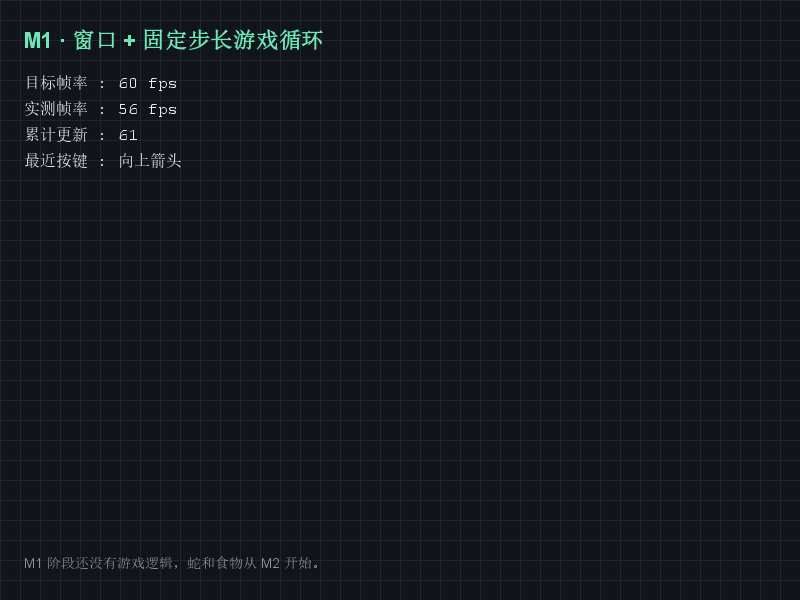

# java-snake

用 Java 17 + Swing 写的贪吃蛇。这是第一个正式项目，目标是走完一遍完整的开发流程：
需求 → 设计 → 编码 → 测试 → 打包 → 发布。

## 运行画面



800×600 窗口，网格背景，左上角实时显示目标帧率、实测帧率、累计更新次数和最近按下的键。
（这张图由项目自己的绘制代码离屏渲染生成，帧率与更新次数是真实测得的值。）

## 当前进度

| 里程碑 | 内容 | 状态 |
| --- | --- | --- |
| M1 | Swing 窗口 + 固定步长游戏循环 | 已完成 |
| M2 | 蛇的移动、键盘控制、撞墙判定 | 待开始 |
| M3 | 食物、成长、分数 | 待开始 |
| M4 | 撞自己结束、重开、打包发布 | 待开始 |

## 环境要求

- JDK 17
- Maven 3.9.16

## 运行

```
mvn clean package
java -jar target/java-snake-0.1.0.jar
```

开发期想快速跑一遍，不想打包：

```
mvn -q compile
java -cp target/classes com.example.snake.Main
```

自检模式（跑 1.5 秒后自动输出帧数并退出，用于确认环境没问题）：

```
java -cp target/classes com.example.snake.Main --selftest
```

## 测试

```
mvn test
```

## 代码结构

| 文件 | 职责 |
| --- | --- |
| `Main.java` | 程序入口，装配窗口与游戏循环 |
| `SnakeFrame.java` | 主窗口 |
| `GamePanel.java` | 画布，负责绘制与接收键盘输入 |
| `GameLoop.java` | 固定步长游戏循环（纯逻辑，不依赖 Swing） |
| `GameConfig.java` | 窗口尺寸、帧率等常量 |

设计上有一条硬规则：**游戏循环不能依赖 Swing**。这样它才能在单元测试里被验证，
将来换渲染方式（比如换成 JavaFX）也不用重写。

## 讲解卡

- [M1 讲解卡](docs/M1-讲解卡.md)

## 许可

MIT
