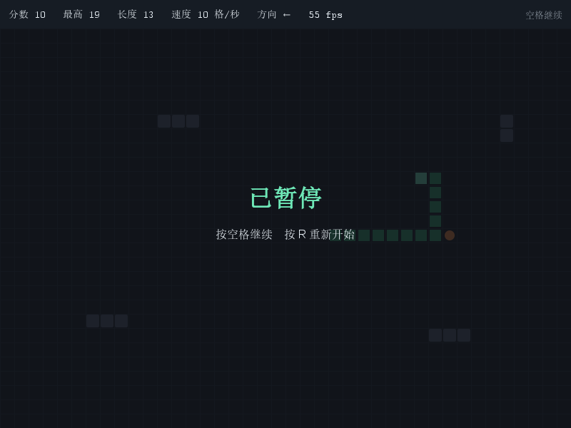

# M6 讲解卡　空格暂停

## 一、这一单元做了什么

按**空格**暂停，画面变暗并显示"已暂停"，再按一次继续；暂停期间蛇不动、方向键也无效；
暂停时按 R 可以直接重开。



**验收标准**：`mvn test` 全绿（共 32 个）；运行起来按空格画面立刻静止，等几秒再按空格，
蛇从原处接着走（不会"补跑"暂停期间攒下的帧）。

## 二、知识点 1：暂停不该是一个 State

最省事的做法是往 `State` 枚举里加一个 `PAUSED`，然后 `tick()` 里判断一下。但这样做会立刻踩两个坑：

**坑一：结束判定被污染。** `GamePanel` 里"刚刚死掉就保存最高分"的判断是
`上一帧还是 RUNNING、这一帧不是 RUNNING`。如果 PAUSED 也是一个 State，
那么暂停一下就会被当成"刚结束"，当场把当前分数写进最高分——玩家暂停一下，最高分莫名其妙涨了。

**坑二：绘制层要加特判。** `state != RUNNING` 现在表示"该画结束画面了"，
加了 PAUSED 之后就得改成"不等于 RUNNING 并且不等于 PAUSED"，每加一个临时状态都要再改一次。

根子上的区别是：**`State` 回答的是"这一局怎么结束的"，四个终局值都是不可逆的；
而暂停是可逆的、临时的。** 两种不同性质的东西塞进一个枚举，代码就会到处出现特判。

所以本项目用了一个独立的布尔量 `paused`：语义清楚，结束判定完全不受影响。
这类判断在真实项目里非常常见——**看一个状态"能不能自己走回去"，就能判断它该不该和终局状态放在一起**。

## 三、知识点 2：空格也走"旗子"通道

按键回调运行在 EDT 上，游戏状态只允许在游戏线程上改（M4 里立的规矩）。所以空格键
**不能**直接在回调里调 `togglePause()`，而是走和 R 键一样的通道：

```
按键回调（EDT）：  pauseToggleRequested = true;
游戏循环（游戏线程）： if (pauseToggleRequested) { pauseToggleRequested = false; game.togglePause(); }
```

一个类里同时有"重开旗子"和"暂停旗子"，顺序也有讲究：先处理重开、再处理暂停、最后才 `tick()`。
如果顺序反了，会出现"这一帧先暂停、然后立刻被重开清掉"之类的怪现象。

## 四、知识点 3：暂停要拦住什么，又要放行什么

暂停不是"什么都不做"，而是**明确列出模拟停止的范围**：

| 操作 | 暂停时 | 为什么 |
| --- | --- | --- |
| `tick()` 推进 | 拦住 | 这是暂停的本体，时间必须静止 |
| 方向键 | 拦住 | 暂停时改方向没有意义，还会让恢复瞬间突然拐弯 |
| R 重开 | **放行** | 暂停时想重开是很自然的操作，不该逼玩家先按空格 |
| 绘制 | 放行 | 界面还要刷，不然窗口会白屏 |
| 保存最高分 | 不受影响 | 因为结束判定没被暂停污染（见知识点 1） |

## 五、知识点 4：小功能也要有测试

这次加了三个测试，每个都对着一条容易被写错的规则：

1. `pauseStopsTheClock`：暂停后连跑 10 帧，`moveCount` 一格都不许涨；恢复后接着走
2. `pauseBlocksDirectionInput`：暂停时按方向键不进队列，恢复后方向不变
3. `resetClearsPauseAndFinishedGameIgnoresPause`：重开自动解除暂停；已经结束的局不能暂停

第 3 条里那两个"顺手加上的规则"（重开清暂停、结束不能暂停）如果没写测试，
过两周被人改坏了也没人知道。

## 六、代码怎么读

1. `SnakeGame` 的 `paused` 字段、`togglePause()`、`isPaused()`，以及 `tick()` / `requestDirection()` 里那两处判断
2. `SnakeGame.startNewRound()` 里的 `this.paused = false`
3. `GamePanel` 的 `pauseToggleRequested` 与 `drawPauseScreen()`
4. `SnakeGameTest` 里三个 pause 测试

## 七、动手改造点

1. **窗口失焦自动暂停**：切到别的窗口时自动暂停（提示：`WindowFocusListener` 或
   `addWindowFocusListener`，注意它回调在 EDT 上，仍然要用旗子通知游戏线程）。
2. **暂停时长不计入游戏时间**：先给游戏加一个"本局已经玩了多久"的计时器，再让它忽略暂停期间的时间。
3. **防止误触**：连续快速按空格会反复开关暂停，试试加一个最短间隔（比如 150 毫秒内的第二次按键忽略）。
4. **暂停时显示当前局势**：把蛇长、速度也放大显示在暂停画面上，体会"绘制层只是读状态"这一点。

## 八、自测题

1. 如果把暂停做成 `State.PAUSED`，`GamePanel` 里哪两处代码必须跟着改？分别会出什么 bug？
2. 空格键为什么不能直接在按键回调里调 `togglePause()`？
3. 暂停期间"方向键无效"和"R 键有效"，这两个设计的理由分别是什么？

（答完发我。M1~M5 的题也可以一起补。）
